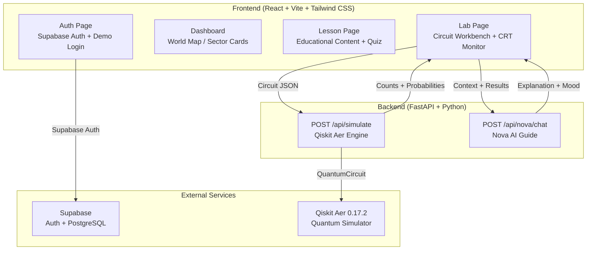

# Quantum Quest — Project Summary

> **A gamified quantum-computing learning platform that transforms abstract physics into hands-on experiments.**

---

## 🎯 What Is Quantum Quest?

Quantum Quest is an interactive educational platform where users learn quantum computing concepts — superposition, quantum gates, and entanglement — by completing **missions**, taking **quizzes**, building **real quantum circuits**, and running **live simulations** on IBM's Qiskit Aer simulator. The entire experience is wrapped in a unique **scientific scrapbook aesthetic**: a dark navy chalkboard pinned with cream notebook paper, masking tape, pushpins, hand-drawn diagrams, and a retro CRT oscilloscope monitor.

---

## 🏗️ Architecture Overview



---

## 🔄 Core User Loop

The entire product demonstrates one complete, polished end-to-end experience:

```
┌─────────────┐
│   LOGIN     │  Supabase Auth or 1-Click Demo Login
└──────┬──────┘
       ▼
┌─────────────┐
│  DASHBOARD  │  "The Quantum Universe" — pinned world cards
└──────┬──────┘
       ▼
┌─────────────┐
│   LESSON    │  Read about Superposition / Gates / Entanglement
│   + QUIZ    │  Answer knowledge-check questions (+50 XP)
└──────┬──────┘
       ▼
┌─────────────┐
│  CIRCUIT    │  Drag H gate onto q[0], CNOT from q[0] → q[1]
│    LAB      │  Interactive 2-qubit workbench on graph paper
└──────┬──────┘
       ▼
┌─────────────┐
│  SIMULATE   │  "RUN ON QISKIT AER" → 1,000 quantum shots
│  (Backend)  │  Real QuantumCircuit execution via qiskit_aer
└──────┬──────┘
       ▼
┌─────────────┐
│  RESULTS    │  CRT Oscilloscope: |00⟩ ≈ 50%, |11⟩ ≈ 50%
│  + NOVA AI  │  Nova explains quantum entanglement
└──────┬──────┘
       ▼
┌─────────────┐
│  COMPLETE!  │  +150 XP, "Entanglement Pioneer" badge
│  DASHBOARD  │  Sector 3 stamped MASTERED, Sector 4 unlocks
└─────────────┘
```

---

## ⚙️ Tech Stack

| Layer | Technology | Purpose |
|:------|:-----------|:--------|
| **Frontend** | React 19 (JavaScript, NO TypeScript) | UI components and routing |
| **Build Tool** | Vite 8 | Fast HMR dev server and production bundling |
| **Styling** | Tailwind CSS 3.4 | Utility-first CSS with custom scrapbook tokens |
| **Auth & DB** | Supabase (Auth + PostgreSQL) | User authentication, profiles, progress tracking |
| **Backend** | FastAPI (Python 3.11) | REST API for simulation and AI endpoints |
| **Quantum Engine** | Qiskit 2.5.2 + Qiskit Aer 0.17.2 | Real quantum circuit simulation (1,000 shots) |
| **AI Guide** | Custom deterministic engine | Contextual explanations with graceful fallbacks |
| **Animations** | canvas-confetti | Celebration effects on mission completion |
| **Icons** | lucide-react | Consistent icon set across the UI |

---

## 📚 Features

### 1. Authentication & Onboarding
- **Supabase Auth** — Email/password sign-up and sign-in
- **1-Click Demo Login** — Instant guest session for hackathon judges (no email verification needed)
- Scrapbook-styled enrollment form on cream manila paper with pushpins and tape

### 2. Dashboard — "The Quantum Universe"
- **World Map Layout** — Cards pinned to a dark navy corkboard representing research sectors
- **4 Sectors/Worlds:**
  - **Sector 1: Quantum Foundations** (Superposition) — completed
  - **Sector 2: Quantum Gates** (Hadamard & Pauli) — completed
  - **Sector 3: Entanglement & Bell States** — active mission
  - **Sector 4: Quantum Algorithms** — locked (future content)
- **XP Progress Bar** — Hand-drawn style with tick marks
- **Today's Mission** — Yellow sticky note highlighting the current challenge
- **Red Connecting Arrows** — Visual flow between world nodes

### 3. Lesson Pages — Interactive Learning
- Educational content sourced directly from curated markdown documents covering:
  - The spinning coin analogy for superposition
  - The measurement postulate and wavefunction collapse
  - Hadamard gate matrix and behavior
  - Quantum entanglement and Bell state construction
- Content displayed on **ruled notebook paper** with pushpins and tape
- **Field Notes** — Amber callout boxes with mathematical definitions

### 4. Knowledge Check Quizzes
- Multiple-choice questions on cream option strips with tape decoration
- **Correct answer** highlighted with green border + checkmark (matching quiz.png)
- Detailed explanations shown after submission
- **+50 XP** reward for passing each quiz
- Confetti celebration on perfect score

### 5. Quantum Circuit Workbench — "The Lab"
- **Interactive 2-qubit circuit canvas** on graph paper with tape at all 4 corners
- **Gate Toolbox** on kraft/cork paper panel:
  - **[H]** Hadamard Gate
  - **[X]** Pauli-X Gate
  - **[CNOT]** Controlled-NOT (multi-qubit)
- Click to place/remove gates at specific steps on qubit wires
- **"Auto-Wire Bell State"** — One-click preset for the correct H + CNOT sequence
- **Circuit Summary** — Real-time display of the current gate sequence
- Visual CNOT connection line between q[0] control dot and q[1] target ⊕

### 6. Real Quantum Simulation (Qiskit Aer)
- Pressing **"RUN ON QISKIT AER"** sends the circuit as JSON to the FastAPI backend
- Backend constructs a real `QuantumCircuit` object and executes on `AerSimulator()`
- **1,000 measurement shots** produce empirical probability distributions
- Results verified against target Bell State distribution:
  - Target: P(|00⟩) = 50%, P(|11⟩) = 50%, P(|01⟩) = 0%, P(|10⟩) = 0%
  - Tolerance: ±0.12 for statistical shot noise
- **Intelligent feedback** on incorrect circuits:
  - "Both qubits in |00⟩" → suggests adding Hadamard
  - "Superposition without entanglement" → suggests adding CNOT
  - "Close but noisy" → passes with 95% score
- **Graceful frontend fallback** — If backend is unreachable, a deterministic browser-side simulation ensures the demo never breaks

### 7. CRT Oscilloscope Monitor
- Retro scientific instrument aesthetic with:
  - **Green phosphor scanlines** and CRT curvature glow
  - **Hardware bezels** with screws, gain/sweep knobs, and status LEDs
  - **4-column probability bar chart** (|00⟩, |01⟩, |10⟩, |11⟩)
  - Animated bar fill with glow effect on high-probability states
  - Status ticker: "ENTANGLED" or "DISENTANGLED"

### 8. Nova AI Laboratory Assistant
- **Contextual, deterministic AI guide** that analyzes simulation results
- Provides scientifically accurate explanations:
  - **On success:** Explains why only |00⟩ and |11⟩ appear (quantum correlation, Einstein's "spooky action at a distance")
  - **On failure:** Diagnoses specific issues (missing H gate, missing CNOT, wrong gate order)
- **Interactive chat** — Users can ask follow-up questions about superposition, Hadamard, entanglement
- **Mood system** — Nova's avatar shows: happy, thinking, curious, excited, celebrating
- **Suggested action pills** — Quick-tap prompts for common questions

### 9. Mission Completion & Gamification
- **Celebration modal** on successful Bell State creation:
  - Canvas confetti animation
  - "VERIFIED BY QISKIT AER" rubber stamp
  - +150 XP reward and "Entanglement Pioneer" badge
- **Persistent progress** via `localStorage` (and Supabase for authenticated users)
- **XP accumulation** — Quizzes (+50 XP) + Missions (+150 XP)
- **Badge collection** — "Quantum Apprentice", "Entanglement Pioneer"
- **Sector unlocking** — Completing Sector 3 stamps it MASTERED and hints at Sector 4

---

## 🎨 Visual Design System — "Scientific Scrapbook"

The entire UI follows a distinctive aesthetic inspired by a researcher's laboratory notebook pinned to a dark corkboard:

| Element | Implementation |
|:--------|:---------------|
| **Background** | Dark navy (#1e293b) with faint chalk-style math equations and atom symbols |
| **Cards** | Cream/manila paper (#faf5e8) with warm shadows lifted off the board |
| **Notebook Paper** | Ruled horizontal lines for lesson content |
| **Graph Paper** | Fine 18px grid for the circuit workbench |
| **Pushpins** | 3D radial-gradient pins (red, gold, blue, green) with specular highlights |
| **Masking Tape** | Semi-translucent beige strips with torn polygon edges at card corners |
| **Rubber Stamps** | Dashed green borders, uppercase text, rotated ("MASTERED", "VERIFIED") |
| **Sticky Notes** | Yellow (#fef08a) for "Today's Mission" callout |
| **Cork/Kraft Panel** | Textured brown for the gate toolbox |
| **CRT Monitor** | Dark green (#0a1f0f) with scanlines, phosphor glow, hardware chrome |
| **Typography** | Patrick Hand / Kalam (handwritten), Outfit (UI), JetBrains Mono (code) |
| **Connecting Lines** | Red SVG arrows between world nodes |

---

## 🗂️ Project Structure

```
OPEN/
├── backend/
│   ├── __init__.py
│   ├── main.py              # FastAPI app with CORS, /api/simulate, /api/nova/chat
│   ├── simulator.py          # Qiskit Aer circuit builder + Bell State verifier
│   ├── nova.py               # Nova AI contextual response engine
│   └── test_sim.py           # Backend integration test
│
├── frontend/
│   ├── index.html            # Entry point with Google Fonts
│   ├── vite.config.js
│   ├── tailwind.config.js    # Custom scrapbook design tokens
│   ├── postcss.config.js
│   ├── package.json
│   └── src/
│       ├── main.jsx
│       ├── App.jsx            # Root router + gamification state
│       ├── supabaseClient.js  # Supabase connection
│       ├── index.css          # Tailwind + custom textures (ruled paper, graph paper, CRT, torn edges)
│       ├── data/
│       │   └── curriculum.js  # All educational content, quizzes, challenge config
│       ├── components/
│       │   ├── Pushpin.jsx         # 3D pushpin with specular highlight
│       │   ├── Tape.jsx            # Masking tape with torn polygon edges
│       │   ├── Stamp.jsx           # Rubber stamp (MASTERED, VERIFIED)
│       │   ├── ChalkEquations.jsx  # Background chalk math equations
│       │   ├── CRTMonitor.jsx      # Retro oscilloscope with probability bars
│       │   ├── CircuitCanvas.jsx   # Interactive circuit workbench
│       │   └── NovaGuide.jsx       # AI assistant with chat + mood
│       └── pages/
│           ├── AuthPage.jsx        # Login/Signup + Demo Login
│           ├── DashboardPage.jsx   # World map with pinned sector cards
│           ├── LessonPage.jsx      # Educational content + quiz
│           └── LabPage.jsx         # Circuit lab + CRT + Nova + celebration
│
├── docs/                     # Source educational content (markdown)
│   ├── superposition.md
│   ├── h-gate.md
│   └── entanglement-and-Bellstate.md
│
├── ui-ux/                    # Source design screenshots (6 images)
│   ├── hero.png
│   ├── world.png
│   ├── circuit-playground.png
│   ├── quiz.png
│   └── ... (2 additional reference images)
│
└── .venv/                    # Python virtual environment
```

---

## 🚀 How to Run

### Backend (FastAPI + Qiskit Aer)
```bash
cd OPEN
.\.venv\Scripts\python.exe -m uvicorn backend.main:app --host 127.0.0.1 --port 8000
```
- Health check: `GET http://127.0.0.1:8000/api/health`
- Simulate: `POST http://127.0.0.1:8000/api/simulate`
- Nova chat: `POST http://127.0.0.1:8000/api/nova/chat`

### Frontend (Vite + React)
```bash
cd OPEN/frontend
npm install
npm run dev
```
- Opens at: `http://127.0.0.1:5173`

### Quick Demo
1. Open `http://127.0.0.1:5173`
2. Click **"Demo Login"** (instant, no email needed)
3. On the Dashboard, click **"ENTER MISSION"** or read lesson notes first
4. In the Lab, gates are pre-wired (H on q[0], CNOT q[0]→q[1])
5. Click **"RUN ON QISKIT AER"**
6. Watch the CRT monitor light up with ~50% |00⟩ and ~50% |11⟩
7. Read Nova's celebration explanation
8. Claim **+150 XP** and the **"Entanglement Pioneer"** badge

---

## 🔬 The Quantum Physics Behind It

### The Bell State |Φ⁺⟩

The core mission asks users to construct the most famous entangled quantum state:

$$|\Phi^+\rangle = \frac{|00\rangle + |11\rangle}{\sqrt{2}}$$

**Step 1 — Hadamard on q[0]:**
$$H|0\rangle = \frac{|0\rangle + |1\rangle}{\sqrt{2}}$$

This creates equal superposition. The 2-qubit state becomes:
$$\frac{|0\rangle + |1\rangle}{\sqrt{2}} \otimes |0\rangle = \frac{|00\rangle + |10\rangle}{\sqrt{2}}$$

**Step 2 — CNOT(q[0], q[1]):**

The CNOT flips q[1] when q[0] is |1⟩:
$$\frac{|00\rangle + |10\rangle}{\sqrt{2}} \xrightarrow{\text{CNOT}} \frac{|00\rangle + |11\rangle}{\sqrt{2}}$$

**Result:** Measuring q[0] as 0 guarantees q[1] is 0. Measuring q[0] as 1 guarantees q[1] is 1. They are **maximally entangled** — what Einstein called *"spooky action at a distance."*

---

## 🏆 Hackathon Differentiators

1. **Real quantum simulation** — Not a mock. Actual Qiskit Aer runs 1,000 shots of a real `QuantumCircuit`.
2. **Unique visual identity** — No other learning platform looks like a researcher's scrapbook pinned to a laboratory wall.
3. **AI-powered explanations** — Nova contextually analyzes simulation results and diagnoses circuit errors.
4. **Complete gamification loop** — XP, badges, sector unlocking, progress persistence.
5. **Instant demo** — 1-Click Demo Login means judges can test the full flow in under 60 seconds.
6. **Graceful fallbacks** — Frontend simulation fallback ensures the demo never breaks, even without backend.
